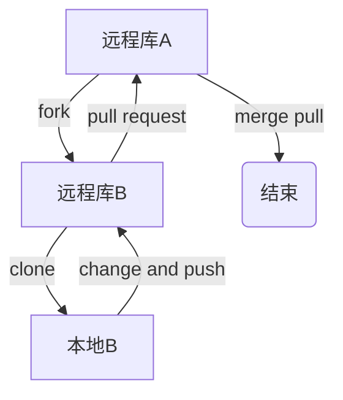

# Git结合Github

## 1.1 创建远程库地址别名

~~~
git remote -v                #查看远程地址别名
git remote add 别名 远程地址  #为远程地址创建别名
git remote add origin https://xx
git remote rm 别名           #移除别名
git remote rename 旧名 新名   #重命名
~~~

## 1.2 本地推送到远程

- 前提：
- commit 提交到了本地库
- 是远程库的团队成员

~~~
git push 别名 分支名
git push origin master

git push -u 别名 分支名  #-u指定默认主机
~~~

## 1.3 远程克隆到本地
~~~
git clone 远程地址
git clone https://xx
~~~

## 1.4 拉取远程的修改

```
git fetch 别名 分支名  #本地还没有改变
git merge 别名 分支名  #本地和远程统一

pull = fetch + merge
git pull 别名 分支名   #一气呵成
```

## 1.5 解决冲突
- **团队成员**基于**最新版**做出修改
- 不是基于远程库最新版做的修改不能推送，必须先 pull，若有冲突手动解决
- 解决冲突后的提交不能带文件名

## 1.6 团队内部合作
- 邀请成员

- 团队成员可 clone、**push**

## 1.7 跨团队合作
- 贡献开源代码
- 


## 1.8 SSH免密登录
- 进入家目录`cd ~`
- 删除.ssh目录`rm -rvf .ssh`
- 生成ssh密钥`ssh-keygen -t rsa -C GitHub邮箱地址`
- 进入.ssh目录`cd .ssh/`
- 查看并复制id_rsa.pub文件内容`cat id_rsa.pub`
- 复制到GitHub`Settings`  --> `SSH and GPG keys` --> `New SSH Key`
- 回到Git通过ssh地址创建`git remote add 别名 SSH地址  `